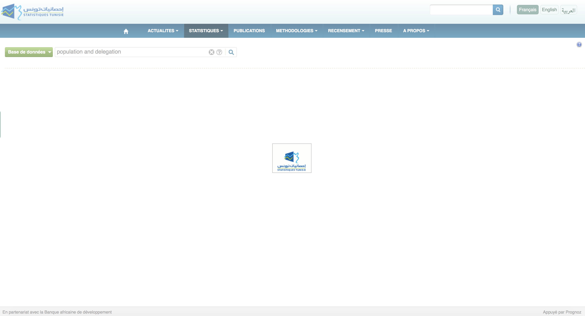
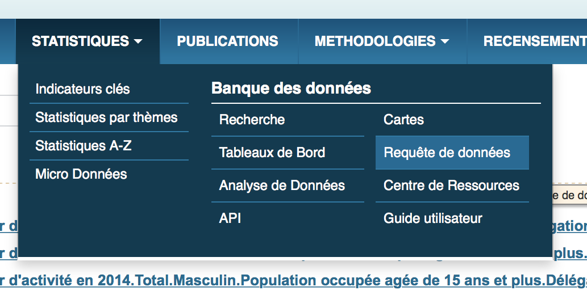
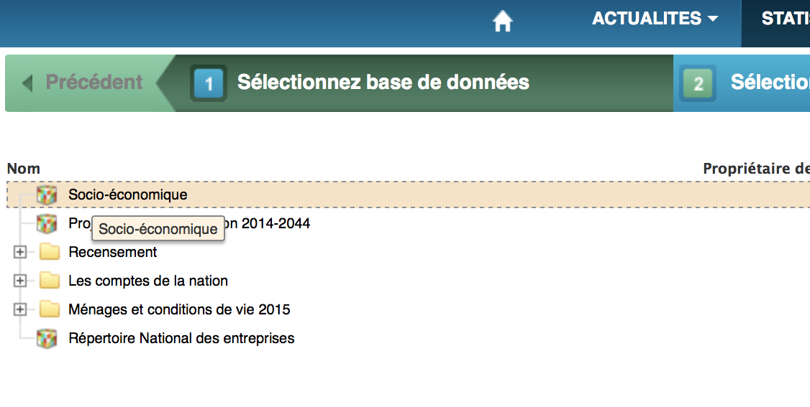
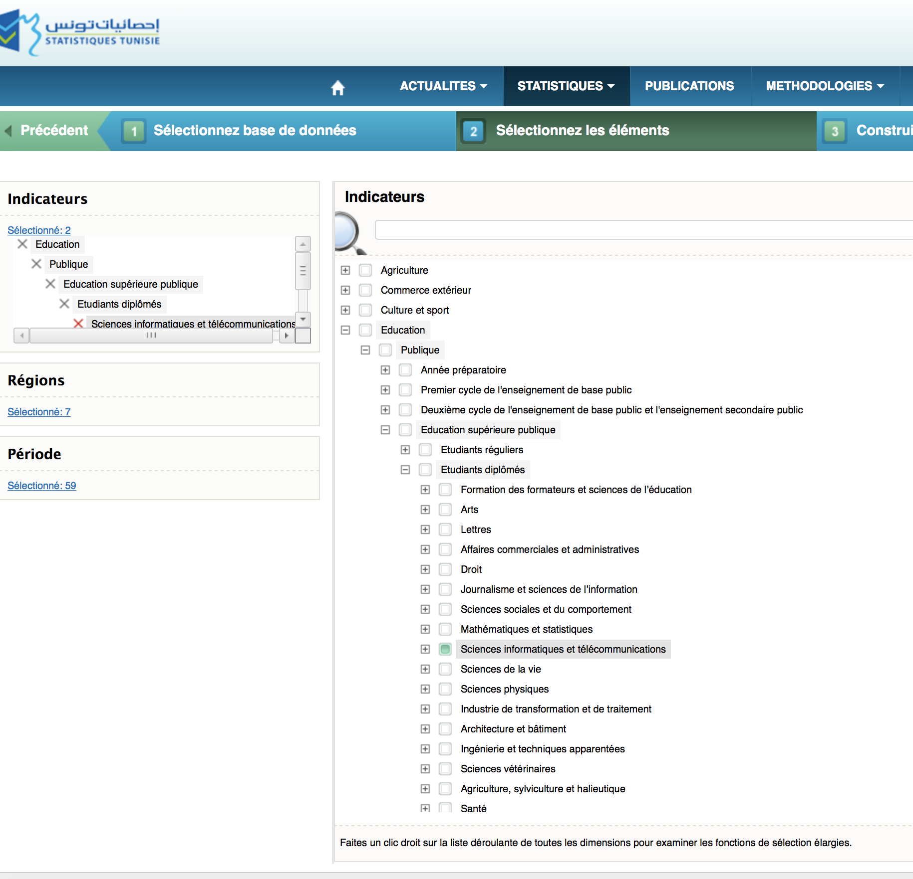
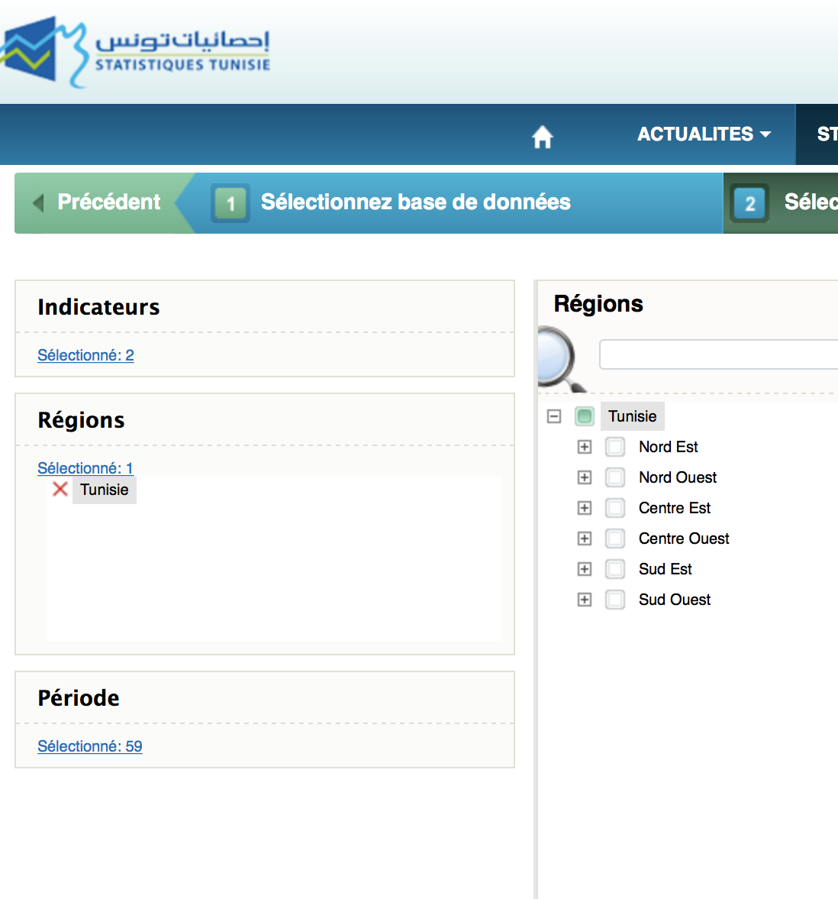
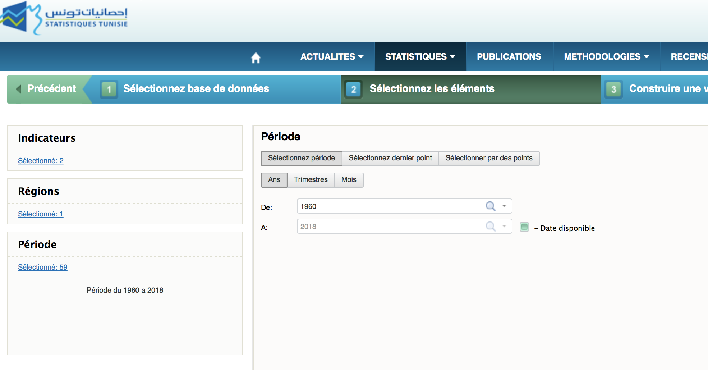
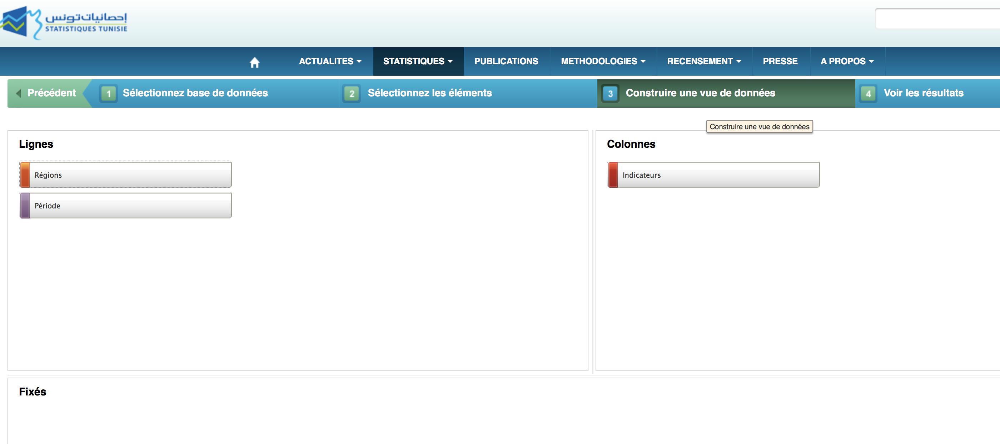
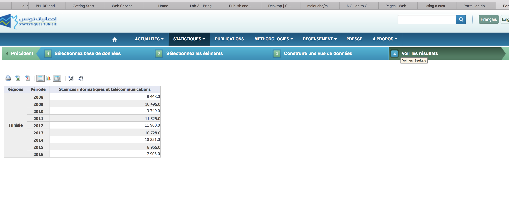

---
output:
  html_document: 
    toc: true
    toc_float: true
---

<link rel="stylesheet" href="styles.css" type="text/css">


```{r setup, include=FALSE}
knitr::opts_chunk$set(echo = TRUE)
```

<p align="center">
<font size="+2">**Collecting Data**</font>
</p>


# http://dataportal.ins.tn


{width=450px}


+  Step 1 

Click *Statistiques > Requêtes des données* 

{width=450px}


+  Step 2

Click on *Sélectionnez base de données* 

{width=450px}


+  Step 3

Let's say we're interested to know the evolution of the number of students in ICT in Tunisia.

Then you pick the indicator 

{width=450px}

+  Step 4

You pick the region 

{width=450px}

+  Step 5


You pick the years


{width=450px}


+  Step 6

Click on *Contruire une vue des données*

{width=450px}


+  Step 7 

Click on  *Voir les résultats* and your data is ready to be downloaded

{width=450px}


<iframe width="560" height="315" src="http://www.youtube.com/embed/KVG38qw0cTk?rel=0" frameborder="0" allowfullscreen></iframe>


# Penn World Table: https://www.rug.nl/

It is a database with information on relative levels of income, output, input and productivity, covering 182 countries between 1950 and 2014.


<iframe width="560" height="315" src="http://www.youtube.com/embed/XLkfq5M5HSY?rel=0" frameborder="0" allowfullscreen></iframe>

# UN Development Index: http://hdr.undp.org/

This website contains several datasets on development indexes as Human Development Index, Gender Development Index, Gender Inequality Index

## Human Development Index


<iframe width="560" height="315" src="http://www.youtube.com/embed//meo_jltNm-k?rel=0" frameborder="0" allowfullscreen></iframe>


## Gender Development Index


<iframe width="560" height="315" src="http://www.youtube.com/embed//p1CmU4ra2UY?rel=0" frameborder="0" allowfullscreen></iframe>


##  Gender Inequality Index

# World Development Indicators 

## What's the WDI?

+ [https://data.worldbank.org/products/wdi](https://data.worldbank.org/products/wdi)

+ *The primary World Bank collection of development indicators, compiled from officially-recognized international sources. It presents the most current and accurate global development data available, and includes national, regional and global estimates.*

## How can we collect data from WDI website?

<iframe width="560" height="315" src="http://www.youtube.com/embed/f_B1t4BRQ94?rel=0" frameborder="0" allowfullscreen></iframe>

## Microlibrary data from World Open Data


*The Microdata Library facilitates access to data collected through sample surveys of households, business establishments or other facilities. These 'microdata' sets may also originate from population, housing or agricultural censuses or through an administrative data collection processes. The Library contains supporting documentation from censuses and surveys conducted or supported by the World Bank, as well as by other international organizations, statistical agencies and other agencies in low and middle-income countries.*


<iframe width="560" height="315" src="http://www.youtube.com/embed/J4uUdkU_K-4?rel=0" frameborder="0" allowfullscreen></iframe>


# The Armed Conflict Location & Event Data: https://www.acleddata.com/


*The Armed Conflict Location & Event Data Project (ACLED). collects the dates, actors, types of violence, locations, and fatalities of all reported political violence and protest events across Africa, South Asia, South East Asia, the Middle East, Europe, and Latin America. Political violence and protest includes events that occur within civil wars and periods of instability, public protest and regime breakdown. ACLED’s aim is to capture the forms, actors, dates and locations of political violence and protest as it occurs across states. The ACLED team conducts analysis to describe, explore and test conflict scenarios, and makes both data and analysis open to freely use by the public.*


<iframe width="560" height="315" src="http://www.youtube.com/embed/bHI5tylun48?rel=0" frameborder="0" allowfullscreen></iframe>


# Afrobarometer Data: http://afrobarometer.org

This Data is obtained from regular Surveys implemented in almost 36 countries on public attitude  on democracy, governance, economic conditions, and related issues. 


<iframe width="560" height="315" src="http://www.youtube.com/embed/B5kclKW2I9U?rel=0" frameborder="0" allowfullscreen></iframe>


# G-Econ Data: https://gecon.yale.edu 

The G-Econ research project is devoted to developing a geophysically based data set on economic activity for the world. The current data set (GEcon 4.0) is now publicly available and covers “gross cell product” for all regions for 1990, 1995, 2000, and 2005 and includes 27,500 terrestrial observations.

This data was by Professor William Nordhaus, Yale University and and Professor Xi Chen, Quinnipiac University.  Professor William Nordhaus  won  this year (yesterday) the Nobel Prize in Economic Sciences: https://news.yale.edu/2018/10/08/yales-william-nordhaus-wins-2018-nobel-prize-economic-sciences?utm_source=YNemail&utm_medium=email&utm_campaign=yn-10-08-18 

Here'a an `R` on how can you  extract the data in your computer 


1. You need to extract the names of the countries listed in the G-Econ Data 

```{r, eval=F, prompt=T, cache=T}
library(rvest)
library(purrr)
library(XML)
library(RCurl)
url<-"https://gecon.yale.edu/country-listing"

doc <- getURL(url)


html <- htmlTreeParse(doc, useInternal = TRUE)
txt <- xpathApply(html, "//body//text()[not(ancestor::script)][not(ancestor::style)][not(ancestor::noscript)]", xmlValue)
txt<-unlist(txt)
i=grep("\n",txt)
txt=txt[-i]
txt=txt[-c(1:23)]
txt=txt[1:274]
txt
i=grepl("^\\s*$", txt)
countries=txt[i==F]

countries
```


2. We once we have the names of the countries, we will extract the links of every file containing the data

```{r, prompt=T, cache=T,eval=F}
library(stringr)
links=vector('list',length(countries))
zc=gsub(pattern = " ",replacement = "_",tolower(countries))
zc[85]="uk"
zc[86]="usa"
for(i in 1:length(countries)){
  print(i)
  u1=paste0("https://gecon.yale.edu/",zc[i])
  d1<- getURL(u1)
  
  matched <- str_match_all(d1, "<a href=\"(.*?)\"")
  r=grep("_upload",matched[[1]])
  x=gsub("<a href=\"https://", "", matched[[1]][r[1],1])
  xpath=paste0("https://",x)
  xpath=gsub(pattern = "\"",replacement = "",xpath)
  links[[i]]=xpath
}
links
links[[85]]="https://gecon.yale.edu/sites/default/files/uk_upload_xi_101509.xls"
links[[15]]="https://gecon.yale.edu/sites/default/files/central_africa_upload_mm_051905_0.xls"
links[[86]]="https://gecon.yale.edu/sites/default/files/upload_us_xi_090110.xls"
links[[75]]="https://gecon.yale.edu/sites/default/files/southafrica_upload_xi_091510.xls"
links[[75]]="https://gecon.yale.edu/sites/default/files/south_korea_upload_qa_061005.xls"
links[[21]]="https://gecon.yale.edu/sites/default/files/czech_republic_upload_xi_101509.xls"
links[[76]]="https://gecon.yale.edu/sites/default/files/south_korea_upload_qa_061005.xls"
links[[71]]="https://gecon.yale.edu/sites/default/files/saudi_arabia_upload_qa_050205_0.xls"
links[[64]]="https://gecon.yale.edu/sites/default/files/papua_new_guinea_upload_qa_061305.xls"
links[[44]]="https://gecon.yale.edu/sites/default/files/lao_pdr_upload_qa_061505_0.xls"
links[[61]]="https://gecon.yale.edu/sites/default/files/north_korea_upload_qa_051905.xls"
links[[58]]="https://gecon.yale.edu/sites/default/files/new_zealand_upload_mm_071805.xls"
```

Notice that some links need to be changed because the names of the files are not with the same standards as the other files. 

3. You need now to doanload all excel files:

```{r, eval=F,prompt=T, cache=T}
for(j in 1:length(links)){
  u1=links[[j]]
  download.file(url = u1,destfile = paste0(zc[j],".xls"))
}
```


4. Finaly you can imports all these files into `R`: 

```{r,  eval=F,prompt=T, cache=T}
library(readxl)
list.files()
i=grep("xls",list.files())
length(i)
length(zc)
files_xls=list.files()[i]

data_list=vector('list',length(zc))
for(i in 1:length(zc)){
  data_list[[i]]<- read_excel(files_xls[i])
  data_list[[i]]<-data_list[[i]][-1,]
}

names(data_list)=zc

for(i in 1:length(zc)){
  colnames(data_list[[i]])=tolower(colnames(data_list[[i]]))
}

library(plyr)

data_all=ldply(data_list)
```


